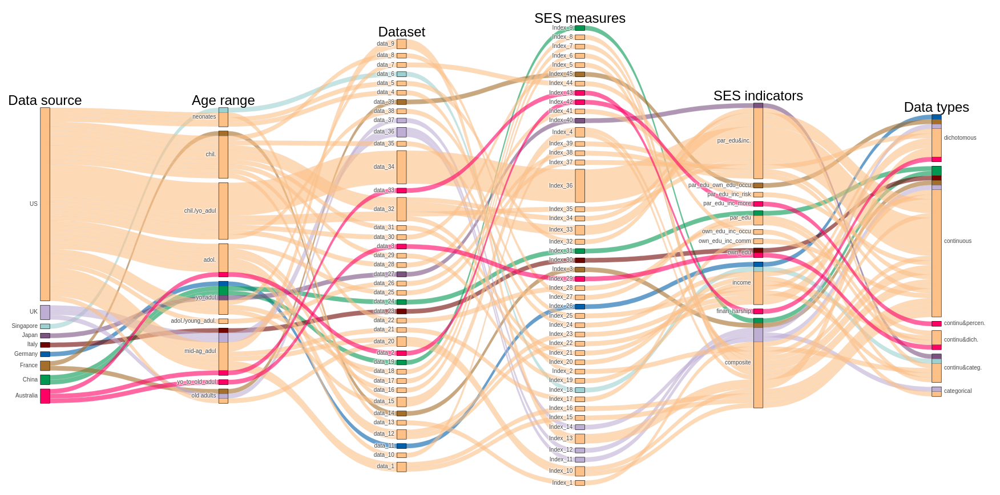

# Assessment flexibility in the measurement of SES

## Overview
This project aims at assessing the flexibility in measureing SES in cognitive neuroscience. See our [PPT for NeuroMatch 2.0](https://osf.io/gcxs6/) for more details about this project.

## Reproducing SES scores using open dataset
We will use data from [China Family Panel Study, CFPS](https://opendata.pku.edu.cn/dataverse/CFPS?language=en) and [Panel Study of Income Dynamics (PSID) ](https://psidonline.isr.umich.edu/) to reproduce the SES scores following the ways of calculating SES that we extracted from the literature. 

### Data preparation
* CFPS: we downloaded the 2010 data from the CFPS and then extracted data using `data_extraction_CFPS.R`. 
  * Input: CFPS2010’s children dataset (`2010Children.csv`); adults dataset (`2010adult.csv`); familydataset (`2010family.csv`); community dataset (`2010community.csv`)
  
  * Output: a combined Rdata (`CFPS2010.RData`) containing selected variables from `2010Children.csv` (`df.children`); `2010adult.csv` (`df.individual`); `2010family.csv` (`df.family`); and `2010community.csv` (`df.community`)

* PSID: we selected relevant variables from PSID using the provided varible selection system in the website of PSID; checking the selected varibles and also age and gender distribution of participants using `data_extraction_PSID.R`. 

### SES scores reproduction
* We used `SES_scores_calculation.R` to calculate the SES scores (currently with 11 ways). 

* Output: two RData files containing all the SES measurements calculated of each participants (`SES_CFPS.RData`; `SES_PSID.RData`)

### Assess the flexibility and variability
We used `Correlation_analyses.R` to quantify the variability caused by the flexibility. To visualize the flexibility, we used `SankeyPlot_trial.r`, which still needs further revision.

##### Correlation between SES scores
* All the SES scores are positively correlated but the strength vary from R = 0.17 to R = 0.99 (CFPS); R = 0.43 to R = 0.95

###### ICC
We used Intra-Class Correlation (Two-way random effect model for single measurement agreement) to quantify the consistency between different SES scores. In this way, we view each way of calculating SES as the rating of a "rater", and ICC can estimate how consistent are these "raters" are. 

* CFPS: 

* PSID: . 

##### Variability in effect size caused by SES measurement flexibility

We used a few surrogate target variable to estimate the variability.

* CFPS: The correlation between different SES scores and depression score varied from XX to XX; between SES scores and cognitive ability varied from XX to XX.

* PSID: The correlation between different SES scores and depression score varied from XX to XX; between SES scores and life satification varied from XX to XX.
